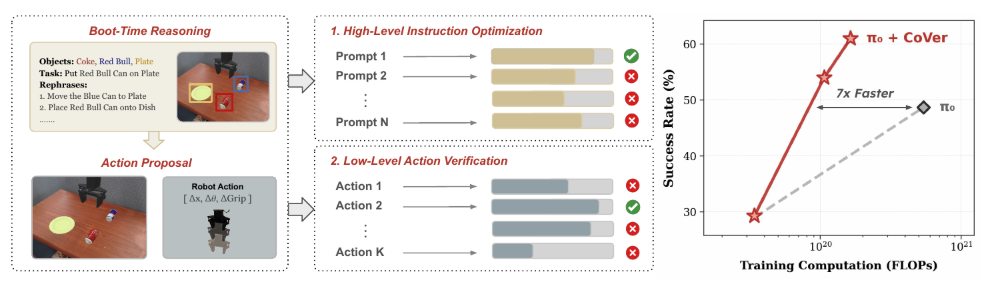

<h2 align="center">Scaling Verification Can Be More Effective than Scaling Policy Learning for Vision-Language-Action Alignment</h2>

<p align="center">
  <a href="https://arxiv.org/abs/2602.12281"></a>
  &emsp;&emsp;
  <!-- <a href="https://github.com/cover-vla/cover-vla"></a> -->
  <a href="https://cover-vla.github.io"></a>
  &emsp;&emsp;
  <a href="https://huggingface.co/stanfordasl/CoVer-BridgeV2"></a>
  <!-- <a href="LICENSE"></a> -->
</p>

<div align="center">
  
</div>

## Table of contents

- [Setup](#-setup)
- [Download Verifier Checkpoint](#-download-verifier-checkpoint)
- [Run Inference](#-run-inference)
- [Visualize Results](#-visualize-results)


## 🛠️ Setup

### Prerequisites

- Linux
- Python 3.10
- CUDA-capable GPU
- [uv](https://github.com/astral-sh/uv) (installed automatically by the setup script)

### Installation

From the **vla-clip** repository root:

```bash
bash CoVer_VLA/scripts/env_simpler_pi.sh
```

This script:

1. Creates virtual environment at `vla-clip/.venv_cover`
2. Installs dependencies from `requirements.txt`
3. Installs SimplerEnv (ManiSkill2, simpler_env) without conflicting deps
4. Installs LeRobot with PI0 support (`lerobot_custom`)
5. Installs Bridge Verifier
6. Installs the inference package
7. Pins PyTorch and Transformers versions

### Activate Environment

```bash
cd cover-vla
source .venv_cover/bin/activate
```


## 📥 Download Verifier Checkpoint

The CoVer action verifier requires a pretrained checkpoint (~312MB). Download it from Hugging Face. **Activate the environment first** (huggingface-cli is provided by the venv):

```bash
source .venv_cover/bin/activate
cd bridge_verifier
huggingface-cli download stanfordasl/CoVer-BridgeV2 cover_verifier_bridge.pt --local-dir .
cd ..
```

Or with the newer CLI:

```bash
source .venv_cover/bin/activate
cd bridge_verifier
hf download stanfordasl/CoVer-BridgeV2 cover_verifier_bridge.pt --local-dir .
cd ..
```

The checkpoint will be saved to `bridge_verifier/cover_verifier_bridge.pt`, which is automatically loaded when running inference with `--use_verifier True`.

**Hugging Face:** [stanfordasl/CoVer-BridgeV2](https://huggingface.co/stanfordasl/CoVer-BridgeV2)


## 🚀 Run Inference

### Option 1: Run via test script

```bash
cd CoVer_VLA/inference/experiments/robot/simpler/bashes
./test_pi.sh
```

This runs evaluation on `simpler_widowx` and `simpler_ood` with the verifier enabled.

### Option 2: Run with custom arguments

```bash
cd CoVer_VLA/inference/experiments/robot/simpler/bashes
python ../run_simpler_eval_with_openpi.py \
    --task_suite_name simpler_widowx \
    --lang_transform_type rephrase \
    --pretrained_checkpoint juexzz/INTACT-pi0-finetune-bridge \
    --num_trials_per_task 100 \
    --use_verifier True \
    --policy_batch_inference_size 5 \
    --lang_rephrase_num 8
```

### Key arguments

| Argument | Default | Description |
|----------|---------|-------------|
| `--task_suite_name` | `simpler_widowx` | Task suite: `simpler_widowx`, `simpler_ood`, `simpler_put_eggplant_in_basket`, `simpler_stack_cube`, etc. |
| `--use_verifier` | `True` | Use action verifier to select best action |
| `--policy_batch_inference_size` | `2` | Number of actions sampled per instruction |
| `--lang_rephrase_num` | `8` | Number of language rephrases |
| `--num_trials_per_task` | `100` | Episodes per task |
| `--pretrained_checkpoint` | `juexzz/INTACT-pi0-finetune-rephrase-bridge` | PI0 model (or `juexzz/INTACT-pi0-finetune-bridge`) |

### Baseline without verifier

```bash
python ../run_simpler_eval_with_openpi.py \
    --task_suite_name simpler_widowx \
    --use_verifier False \
    --policy_batch_inference_size 1 \
    --lang_rephrase_num 1
```


## 📊 Visualize Results

### Run analysis script

After inference, rollout videos and episode data are saved under:

- `rollouts_openpi_original/` (for `juexzz/INTACT-pi0-finetune-bridge`)
- `rollouts_openpi_rephrase/` (for `juexzz/INTACT-pi0-finetune-rephrase-bridge`)

To generate analysis plots:

```bash
cd CoVer_VLA/inference/experiments/robot/simpler/bashes
python analyze_success_rate.py --output-dir ./analysis_plots
```

### Generated outputs

| Output | Description |
|--------|-------------|
| `success_rates_all_experiments.png` | Success rates across all experiment types |
| `success_rates_original.png` | In-distribution task success rates |
| `success_rates_rephrase.png` | Rephrase experiment success rates |
| `success_rates_robomonkey.png` | Verifier-based experiment success rates |
| `verifier_scores/` | Verifier score trajectories over time |
| `verifier_distributions/` | Verifier score distribution plots |
| `similarity_vs_time_by_language_folders.png` | Success/failure trajectories by similarity |
| `evaluation_mean_std_*.png` | Per-folder evaluation statistics |

### Analysis options

```bash
python analyze_success_rate.py --output-dir ./analysis_plots
python analyze_success_rate.py --output-dir ./my_plots --include-insufficient
```

- `--output-dir`: Where to save plots (default: `./analysis_plots`)
- `--include-insufficient`: Include tasks with only one experiment type (default: filter out)


## 📁 Output Locations

| Output | Path (relative to run directory) |
|--------|----------------------------------|
| Text logs | `experiments/logs/EVAL-<task>-<model>-<timestamp>.txt` |
| Rollout videos (.mp4) | `rollouts_openpi_*/transform_*/lang_*_sample_*/` |
| Episode data (.pkl) | Same as rollout videos |
