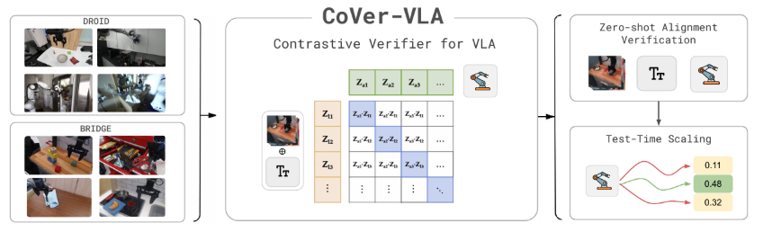

<h2 align="center">Scaling Verification Can Be More Effective than Scaling Policy Learning for Vision-Language-Action Alignment</h2>

<p align="center">
  <sub>Jacky Kwok<sup>1,†</sup>, Xilun Zhang<sup>1,†</sup>, Mengdi Xu<sup>1</sup>, Yuejiang Liu<sup>1,§</sup>, Azalia Mirhoseini<sup>1,§</sup>, Chelsea Finn<sup>1,§</sup>, Marco Pavone<sup>1,2,§</sup></sub>
</p>

<p align="center">
  <sub><sup>1</sup>Stanford University &emsp; <sup>2</sup>NVIDIA Research &emsp; †Equal contribution &emsp; §Equal advising</sub>
</p>

<p align="center">
  <a href="https://arxiv.org/abs/2602.12281"></a>
  <a href="https://github.com/cover-vla/cover-vla"></a>
  <a href="https://cover-vla.github.io"></a>
  <a href="https://huggingface.co/stanfordasl/CoVer-BridgeV2"></a>
  <a href="LICENSE"></a>
</p>

<div align="center">
  
</div>

---

## Table of contents
- [Setup](#-setup)
- [Action Verifier](#action-verifier)
- [SIMPLER Environment](#simpler-environment)
- [Evaluation Results](#evaluation-results)
- [To-Do](#-to-do)
- [Acknowledgements](#acknowledgements)
- [Troubleshooting](#troubleshooting)

## 🛠️ Setup

Clone this repository:

```bash
git clone https://github.com/cover-vla/cover-vla.git
```

Use the provided script to set up all dependencies:

```bash
bash CoVer_VLA/scripts/env_simpler_pi.sh
```

This script will:
- Install [uv](https://github.com/astral-sh/uv) (if not present)
- Create a virtual environment at `.venv_cover`
- Install dependencies (TensorFlow, PyTorch, SimplerEnv, LeRobot with PI0, Bridge Verifier, etc.)
- Set up PYTHONPATH for the inference package

**Requirements:** Linux, Python 3.10, CUDA-capable GPU.

## ✅ Action Verifier

Download the pretrained checkpoint and spin up the action verifier:

```bash
cd bridge_verifier
huggingface-cli download stanfordasl/CoVer-BridgeV2 cover_verifier_bridge.pt --local-dir .
# Or: hf download stanfordasl/CoVer-BridgeV2 cover_verifier_bridge.pt --local-dir .
cd ..
```

The checkpoint (~312MB) will be saved to `bridge_verifier/cover_verifier_bridge.pt`.

## 🤖 SIMPLER Environment

### Running VLA-CLIP

Activate the environment and run the evaluation script as follows:

```bash
source .venv_cover/bin/activate

cd CoVer_VLA/inference/experiments/robot/simpler/bashes
./test_pi.sh
```

Or run a single task with custom arguments:

```bash
python ../run_simpler_eval_with_openpi.py \
    --task_suite_name simpler_widowx \
    --lang_transform_type rephrase \
    --pretrained_checkpoint juexzz/INTACT-pi0-finetune-bridge \
    --num_trials_per_task 100 \
    --use_verifier True \
    --policy_batch_inference_size 5 \
    --lang_rephrase_num 8
```

- `policy_batch_inference_size`: Number of actions sampled per instruction.
- `lang_rephrase_num`: Number of language rephrases.
- `task_suite_name`: simpler_widowx, simpler_ood, simpler_put_eggplant_in_basket, etc.

### Baseline without Verifier

To disable the verifier and use the base policy only:

```bash
--use_verifier False
```

### Visualize Results

After running inference, analyze success rates and generate plots:

```bash
python analyze_success_rate.py --output-dir ./analysis_plots
```

## 📊 Evaluation Results

### SIMPLER Benchmark

Success rates under red-teaming instructions (8 rephrases, 5 action samples per rephrase). CoVer achieves **22% gain** in-distribution and **13% gain** out-of-distribution over scaling policy learning alone.

**In-Distribution (ID):**

| Task | π0 | π0 + CoVer | π0 (rephrase) + CoVer |
|------|-----|------------|----------------------|
| Carrot on Plate | 48 ± 4 | 48 ± 4 | 52 ± 8 |
| Eggplant in Basket | 74 ± 3 | 89 ± 8 | 95 ± 2 |
| Spoon on Towel | 27 ± 4 | 40 ± 6 | 59 ± 5 |
| Block Stacking | 17 ± 1 | 51 ± 4 | 56 ± 0 |
| **Average** | **41.5** | **57.0** | **65.5** |

**Out-of-Distribution (OOD):**

| Task | π0 | π0 + CoVer | π0 (rephrase) + CoVer |
|------|-----|------------|----------------------|
| Redbull on Plate | 6 ± 1 | 51 ± 3 | 46 ± 3 |
| Zucchini on Towel | 30 ± 3 | 41 ± 1 | 55 ± 6 |
| Tennis in Basket | 53 ± 5 | 91 ± 3 | 85 ± 1 |
| **Average** | **29.7** | **61.0** | **62.0** |

### PolaRiS Benchmark

| Task | π0.5 Task Progress | π0.5 Success | π0.5 + CoVer Progress | π0.5 + CoVer Success |
|------|-------------------|--------------|------------------------|---------------------|
| PanClean | 48.4 ± 1.9 | 10.7 ± 0.9 | 70.4 ± 4.0 | 33.3 ± 6.6 |
| BlockStack | 33.1 ± 1.3 | 0.0 ± 0.0 | 44.3 ± 2.5 | 0.7 ± 0.9 |
| FoodBussing | 38.3 ± 2.4 | 0.7 ± 0.9 | 47.0 ± 4.1 | 5.3 ± 1.9 |
| **Average** | **40.0** | **3.8** | **53.9 (+13.9↑)** | **13.1 (+9.3↑)** |

Logs are saved under: `experiments/logs/` (relative to CWD). Rollout videos: `rollouts_openpi_original/` or `rollouts_openpi_rephrase/`.

## 📋 To-Do

- [x] Initial release on inference pipeline for Bridge env
- [ ] Release verifier training pipeline
- [ ] Develop CoVer verifier server
- [ ] Update DROID evaluation script and checkpointswith PolaRis

## 📚 Acknowledgements

We thank the authors of [LeRobot](https://github.com/huggingface/lerobot), [SimplerEnv](https://github.com/simpler-env/SimplerEnv),[INT-ACT](https://github.com/ai4ce/INT-ACT), [Polaris](https://polaris-evals.github.io/),and related projects for their contributions to the open-source community. Our implementation builds upon these projects.

If you find this project helpful, please consider citing:

```bibtex
@misc{kwok2026scalingverificationeffectivescaling,
      title={Scaling Verification Can Be More Effective than Scaling Policy Learning for Vision-Language-Action Alignment}, 
      author={Jacky Kwok and Xilun Zhang and Mengdi Xu and Yuejiang Liu and Azalia Mirhoseini and Chelsea Finn and Marco Pavone},
      year={2026},
      eprint={2602.12281},
      archivePrefix={arXiv},
      primaryClass={cs.RO},
      url={https://arxiv.org/abs/2602.12281}, 
}
}
```

## 🔎 Troubleshooting

**MuJoCo / OpenGL rendering:** If you encounter display or rendering issues, ensure:

```bash
export MUJOCO_GL=osmesa
export PYOPENGL_PLATFORM=osmesa
```

**Vulkan error:** If you see `No Vulkan extensions found for window surface creation`, you may need to install Vulkan dependencies or use `osmesa` as above.

---

## Project Structure

```
vla-clip/
├── CoVer_VLA/
│   ├── scripts/env_simpler_pi.sh   # Setup script
│   ├── inference/                  # Evaluation and inference
│   │   └── experiments/robot/simpler/
│   │       ├── run_simpler_eval_with_openpi.py
│   │       ├── bashes/
│   │       │   ├── test_pi.sh
│   │       │   └── analyze_success_rate.py
│   │       └── ...
│   └── SimplerEnv/                 # Simulation environment
├── bridge_verifier/                # Action verifier model
├── lerobot_custom/                 # LeRobot with PI0 policy
├── requirements.txt
└── README.md
```

For more details, see [CoVer_VLA/README.md](CoVer_VLA/README.md).
